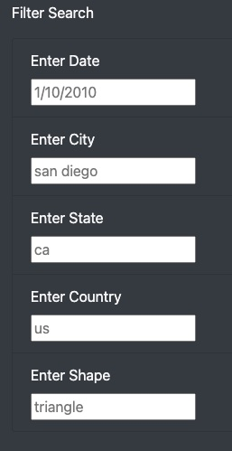

# Overview
Create a custom webpage that showcases different UFO sightings around the world with a dynamic table that allows users to filter for multiple criteria at the same time.

## Resources
- JavaScript (ES6+), HTML, CSS, Bootstrap
- Data Source: data.js

# Results

### Search for UFO sightings using one or more filters
The user may enter the desired date, city, state, country, and/or shape of the UFO sighting by following the placeholder template. 

</img>

- In this example, the user can view all UFO sightings available in this dataset that are from the state of Texas by typing "tx" in the field and pressing 'Enter'.

- In this example, the user can filter multiple fields to find a specific UFO sighting. By entering "ca" for the state and "triangle" for the shape, the results will populate accordingly.

- Note: the user must clear the field or reload the webpage to clear the results and start a new search.

# Summary

- The main drawback of this webpage is that it does not allow for a specific and efficient search for the user.
- One recommendation to improve the user experience involves creating a dropdown menu for each of the filter items. This change will allow the user to see what data is available to view. Especially since the search fields are case-sensitive, this will greatly speed up the process of a user searching for a specific instance within each filter.
- Another recommendation is to add a "Clear" button. Since the user can search using one or more filters, the results will not reset unless a field is cleared manually or unless the webpage is refreshed. 